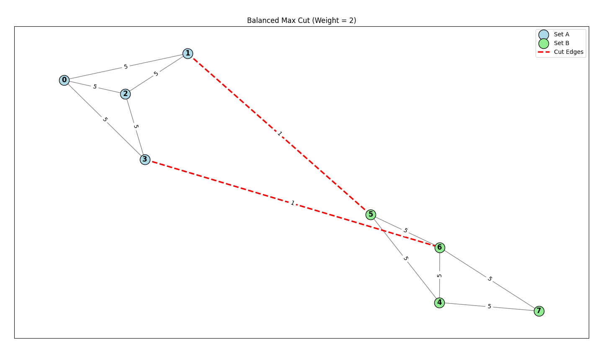
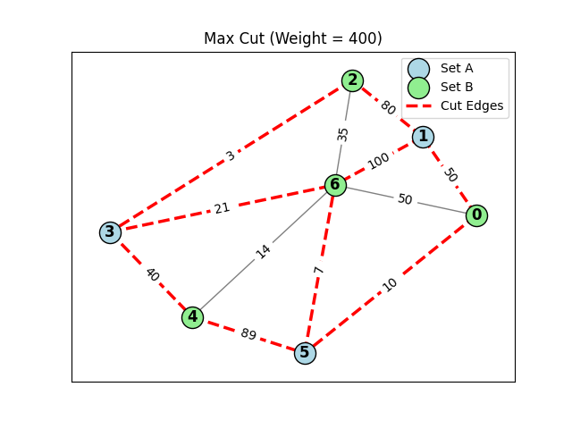
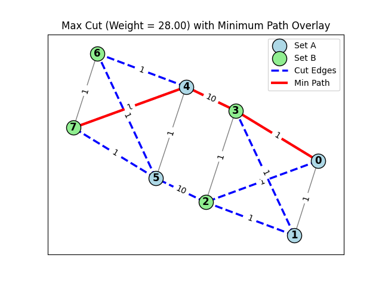
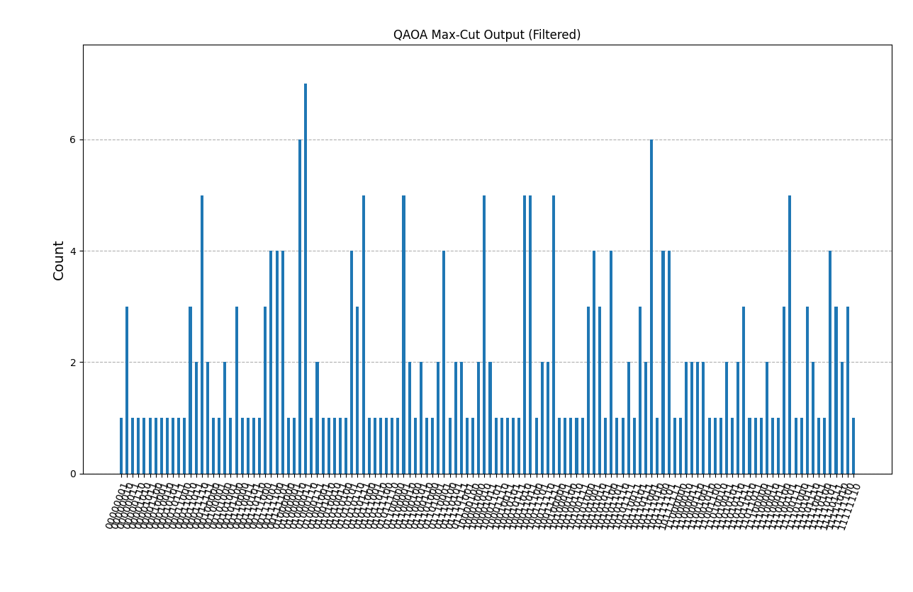
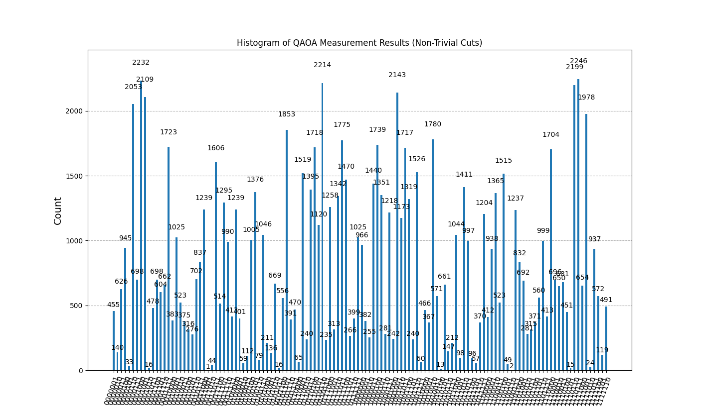
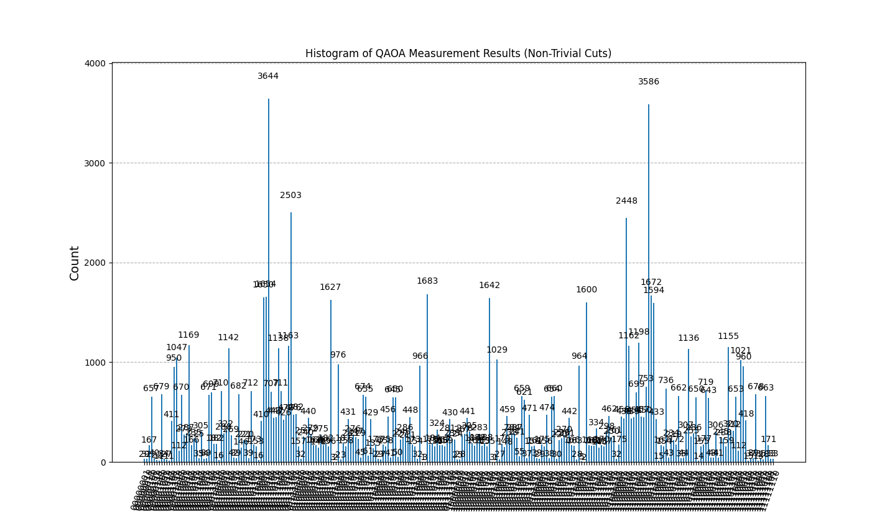

# Consulting Report #3024 - Quantum Bank Operation

We got approached my a bank robber that wishes to rob a multi-level building safe.

For each level of the building, there exists a complex network of security alarms that need to be carefully disabled in order for the next level to be unlocked.

To disable the system, the connectivity of all the nodes needs to fall within a certain threshold, before the survey bot takes a check of the system in a given time interval.

Due to the length of this interval, if the bank robber decides to naively cut every connection, the connectivity of the graph will not fall below the threshold in time for the survey bots connectivity check.

Therefore the robber must find the optimum sequence of cuts in order for the connectivity of the system to fall below the threshold in time.

Additionally, each connection between nodes can have variable secuirity strength (randomised), and the configuration varies from floor to floor.

We developed a quantum optimisation algorithm for the bank robber to find the optimal solution for wire cuts for 3 differing types of scenario.

1)Balanced max cut (Fig.1)  

For this system configuration, this levels system bot checks if all separate graphs on the floor have equal connectivity strengths (within a given range). If the absolute difference of the resulting partitions are greater than the threshold then the alarm is triggered. We used the QAOA optimisation on the max cut problem, and manipulated the algorithm such that each of the internal sets have equivalent edge weights with a given threshold value. 

2)Max weight cut (Fig.2)  

For this  configuration, to disable the system, the cut must be such that it decreases the system connectivity maximally such that the resulting partitions are equal in node number.  Therefore the max cut algorithm had to be adjusted such that the resulting partitions has equivalent nodes.

3)Alarm has been tripped (Fig.3)  

In case of the alarm being tripped, we implement the NetworkX Dijkstra algorithm to solve that floors TSP, so that the bank robber has the most efficient path to proceed/escape.

To demonstrate the max cut sampling employed by the quantum algorithm, see figure 1.1, 2.1, 3.1
  
  
  
